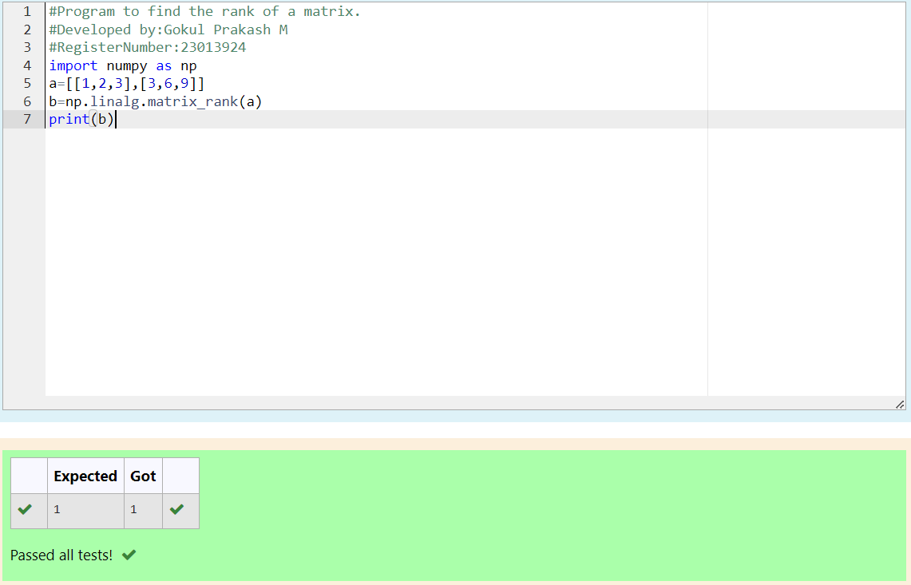

# RANK-OF-A-MATRIX
## Aim:
To write a python program to find the rank of a matrix
## Equipment’s required:
1. 	Hardware – PCs
2. 	Anaconda – Python 3.7 Installation / Moodle-Code Runner
## Algorithm:
### Step 1: 
import numpy as np
### Step 2: 
assign the matrix to a
### Step 3: Using the np.linalg.matrix_rank(), we can find the rank of the given matrix.
### Step 4: 
print
## Program:
#Program to find the rank of a matrix.
#Developed by:Gokul Prakash M
#RegisterNumber:23013924
import numpy as np
a=[[1,2,3],[3,6,9]]
b=np.linalg.matrix_rank(a)
print(b)
## Output:

## Result:
Thus the rank for the given matrix is successfully solved by  using a python program.

